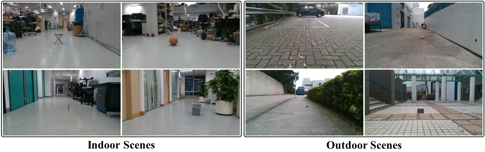

# Ground Mobile Robot Perception Dataset

This is an RGB-D dataset of drivable area and road anomaly segmentation for ground mobile robots (e.g., sweeping robots and robotic wheelchairs).

<p align="center">

</p>


The dataset contains 3896 RGB-D images with hand-labeled segmentation ground truth, which cover 30 common scenes where ground mobile robots usually work (e.g., sidewalks and squares) and 18 different kinds of road anomalies that ground mobile robots may encounter in real environments. `samples` provides two samples of the dataset, and the whole dataset can be downloaded from [Google Drive](https://drive.google.com/file/d/1L5AgsNfCQj814vKO7a2vil984IjhvwQT/view?usp=sharing) or [our Lab NAS](http://gofile.me/4jm56/nxlctFMsI).

RGB images, normalized depth images, original depth images and segmentation labels are stored in `rgb`, `depth_u8`, `depth_u16` and `label`, respectively. The resolution of the images is 1280 x 720 pixels. Since there exist invalid pixels on both sides of the depth images collected by RealSense D415 Camera, we recommend cropping the images before use.

More details on the dataset can be found in our IEEE RA-L paper, [Self-Supervised Drivable Area and Road Anomaly Segmentation using RGB-D Data for Robotic Wheelchairs](https://arxiv.org/abs/2007.05950). We also construct a drivable area and road anomaly detection benchmark based on this dataset in our IEEE T-CYB paper, [Dynamic Fusion Module Evolves Drivable Area and Road Anomaly Detection: A Benchmark and Algorithms](https://arxiv.org/abs/2103.02433).

Please cite our papers if you use our dataset in your publications:
```
@article{wang2021dynamic,
  title     = {Dynamic fusion module evolves drivable area and road anomaly detection: A benchmark and algorithms},
  author    = {Wang, Hengli and Fan, Rui and Sun, Yuxiang and Liu, Ming},
  journal   = {IEEE Transactions on Cybernetics},
  year      = {2021},
  publisher = {IEEE},
  doi       = {10.1109/TCYB.2021.3064089}
}
```
```
@article{wang2019self,
  title     = {Self-supervised drivable area and road anomaly segmentation using {RGB-D} data for robotic wheelchairs},
  author    = {Wang, Hengli and Sun, Yuxiang and Liu, Ming},
  journal   = {IEEE Robotics and Automation Letters},
  volume    = {4},
  number    = {4},
  pages     = {4386--4393},
  year      = {2019},
  publisher = {IEEE},
  doi       = {10.1109/LRA.2019.2932874}
}
```
